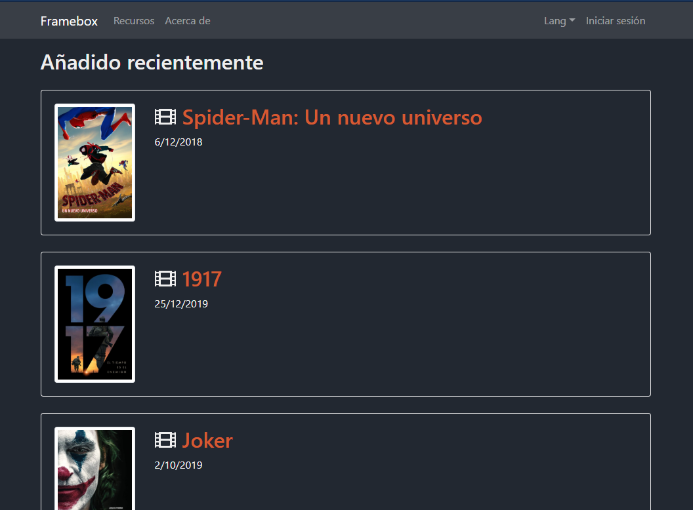
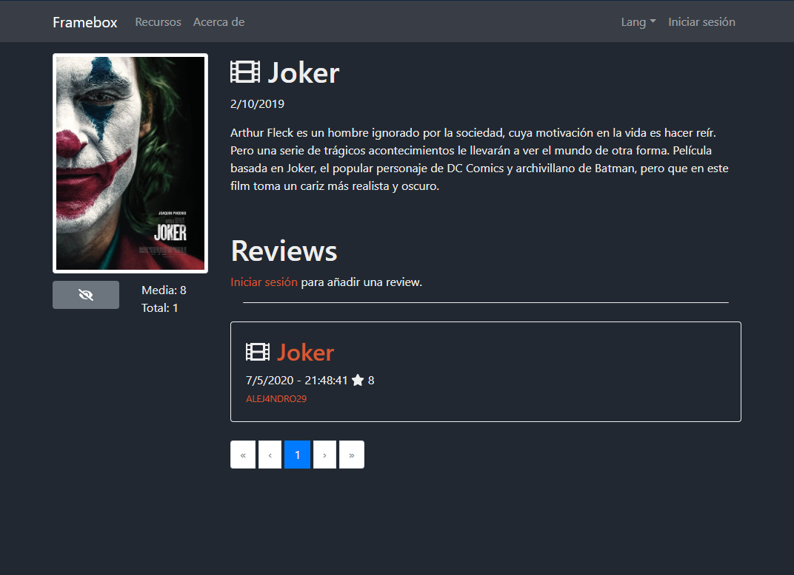
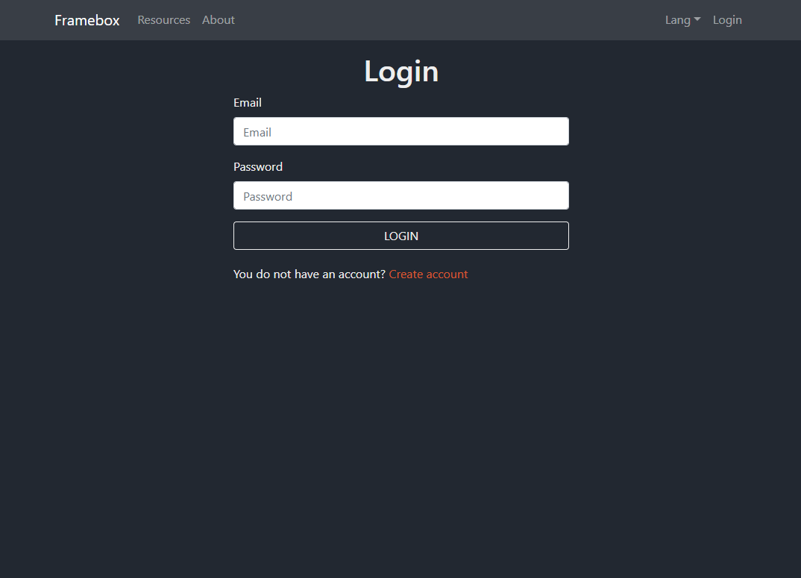
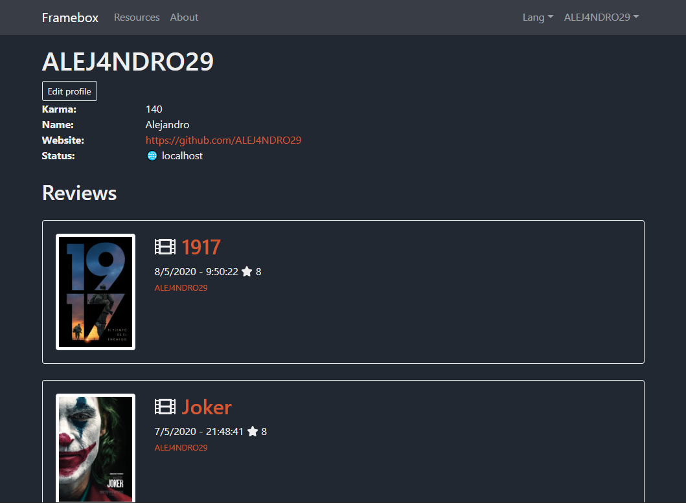
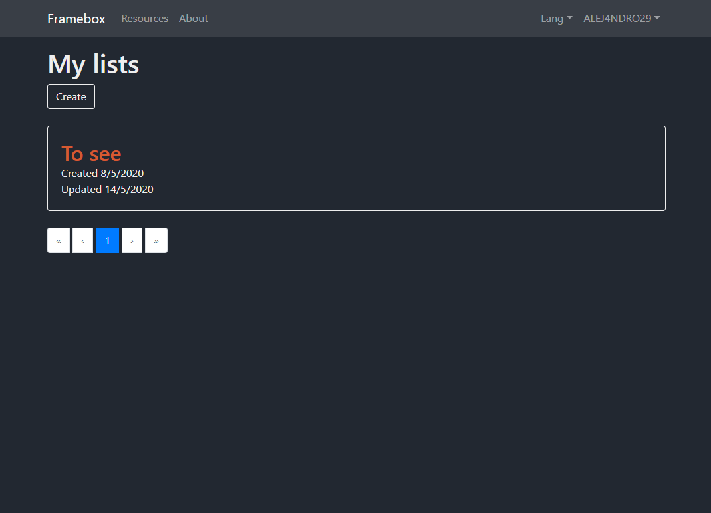

# Framebox - Frontend

Backend repository: <br>
https://github.com/ALEJ4NDRO29/framebox-backend

## Requirements (Used during development)

- [Node 12.16.1](https://nodejs.org/es/)


## Project setup
```
npm install
```

### Compiles and hot-reloads for development
```
npm run serve
```

### Compiles and minifies for production
```
npm run build
```

### Lints and fixes files
```
npm run lint
```

### Customize configuration
See [Configuration Reference](https://cli.vuejs.org/config/).


## Screenshots

### Home


### Resource details


### Login


### Profile


### Lists

